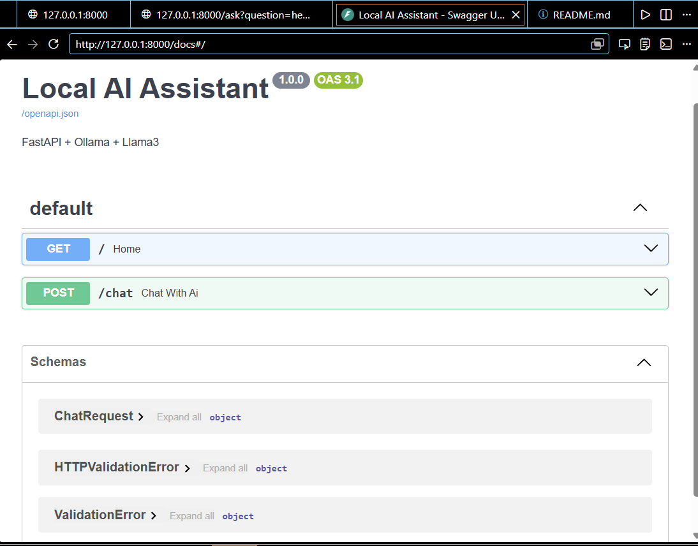
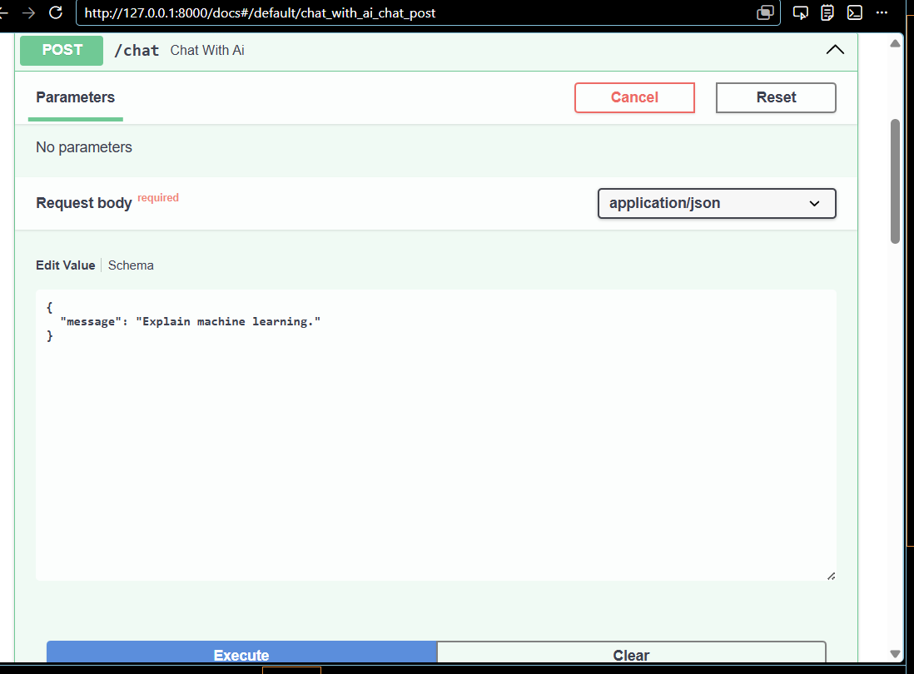
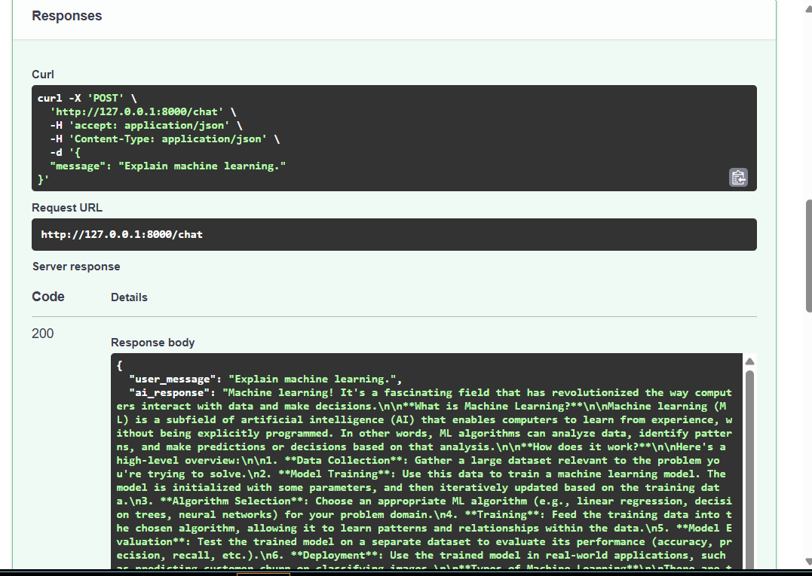

# 🚀 Local AI Engineer Roadmap

A complete hands-on journey from running local LLMs to building production-ready AI applications.

## Current Progress

### Phase 1: Local LLM Deployment ✅

* Installed Ollama
* Downloaded and ran Llama 3
* Connected Python to Ollama
* Generated responses locally

### Phase 2: FastAPI AI Backend ✅

* Built REST APIs using FastAPI
* Connected API endpoints to Llama 3
* Implemented JSON request/response handling
* Tested endpoints through Swagger UI

## Technologies

* Python
* Ollama
* Llama 3
* FastAPI
* Uvicorn

## Upcoming Phases

* RAG with ChromaDB
* Embeddings
* LangChain
* Tool Calling
* AI Agents
* Multi-Agent Systems

## Project Architecture
## 🏗️ Architecture

```text
User
 │
 ▼
FastAPI
 │
 ▼
Python Backend
 │
 ▼
Ollama
 │
 ▼
Llama 3
```

## 📍 Progress Tracker

- [x] Phase 1 - Local LLM Deployment
- [x] Phase 2 - FastAPI AI Backend
- [ ] Phase 3 - Conversation Memory
- [ ] Phase 4 - RAG with ChromaDB
- [ ] Phase 5 - Embeddings
- [ ] Phase 6 - Tool Calling
- [ ] Phase 7 - AI Agents
- [ ] Phase 8 - Multi-Agent System
- [ ] Phase 9 - Docker Deployment

## 📸 Screenshots

### FastAPI Swagger UI



### Chat Endpoint





## Author

Parth Sarthi
